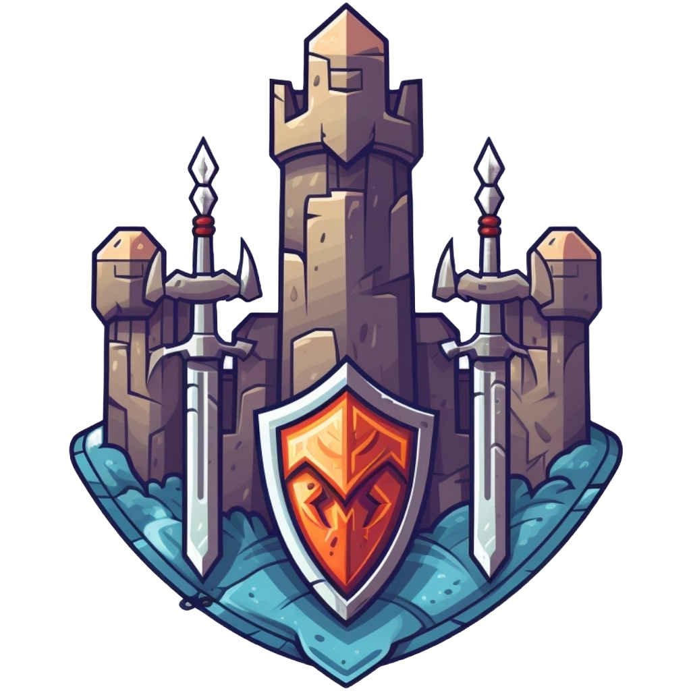

<picture>
  <source media="(prefers-color-scheme: dark)" srcset=".github/zdefender.png">
  
</picture>

# zDefender

zDefender is an onchain game running on Starknet Appchain.

## About

zDefender is a classic Tower Defense and has been build during the [Dojo Game Jam #2](https://itch.io/jam/dojo-game-jam-2).

The game leverages the [Dojo Engine](https://dojoengine.org/), a provable game engine and toolchain for building onchain games and autonomous worlds with Cairo.

## How to play

### Goal

- The only mode is an endless run. It means the only end state is to be defeated by the game.
- User must beat each wave one after the other and try to reach the highest wave to have his name carved on the leaderboard.
- When a mob reaches the user castle, the user loses a life point. When the last life point is lost, the game ends.
- When a wave has been clean, the user can run the next wave while the mobs scale up with the # of wave.

### Towers

- The player can spend his gold to buy towers, each tower has its own attributes.
- The user can either build a new one or upgrade an existing one.

### Mobs

- There are different type of mobs with different attributes, the last mob of each wave is a boss with strongest attributes.
- Each mob death rewards the user with some gold, the stronger is the mob the more the reward are.